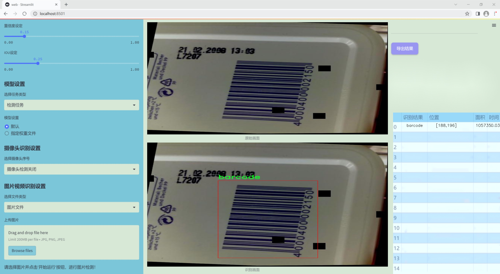
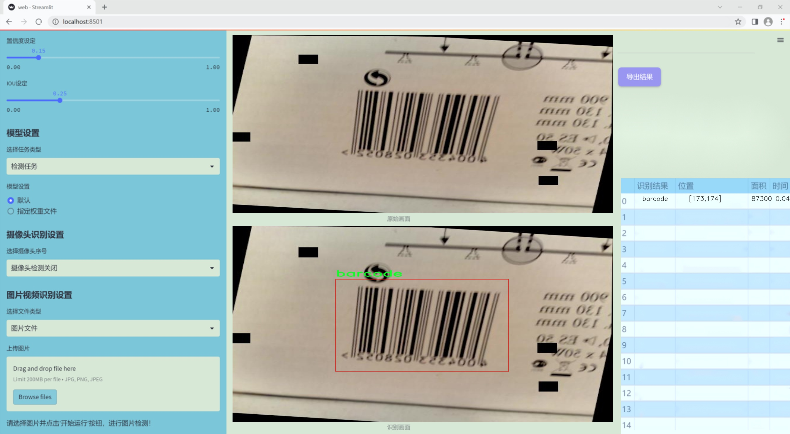
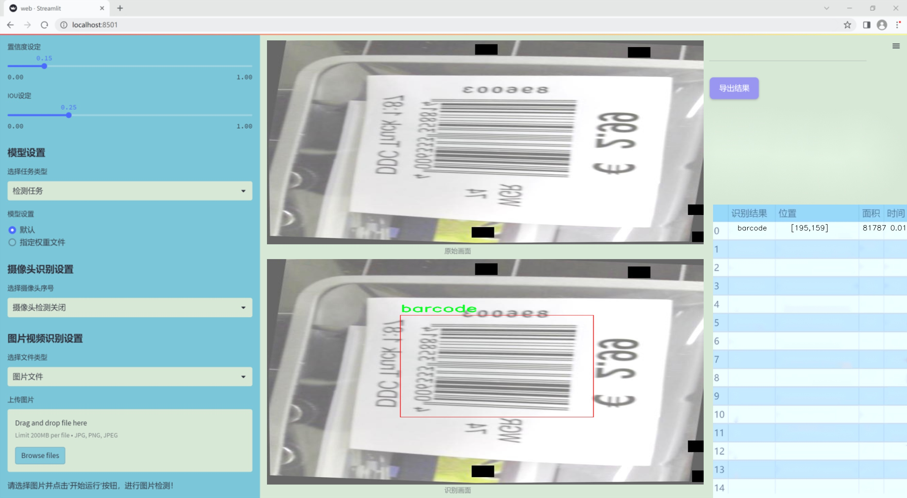
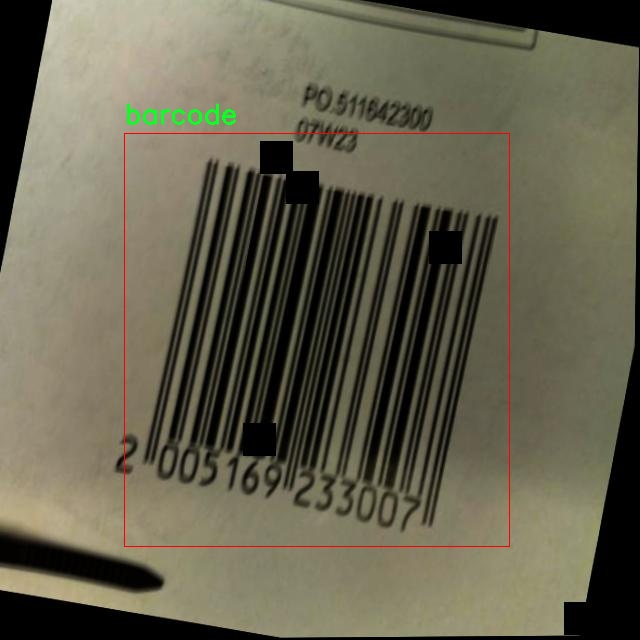
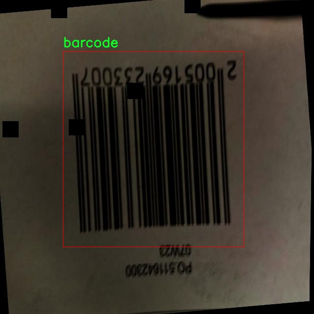
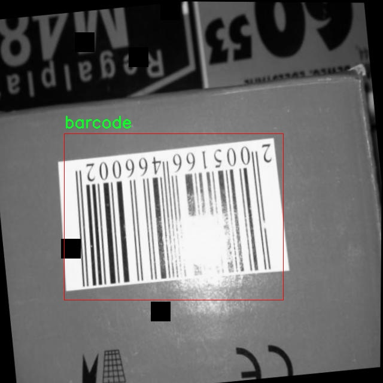
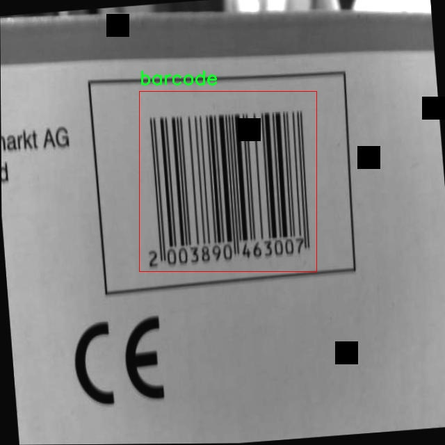
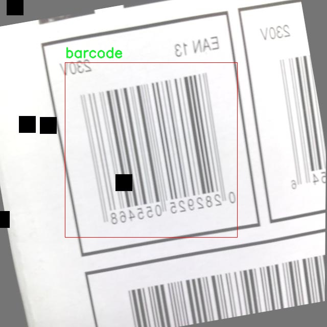

# 改进yolo11-ASF等200+全套创新点大全：条形码检测系统源码＆数据集全套

### 1.图片效果展示







##### 项目来源 **[人工智能促进会 2024.11.03](https://kdocs.cn/l/cszuIiCKVNis)**

注意：由于项目一直在更新迭代，上面“1.图片效果展示”和“2.视频效果展示”展示的系统图片或者视频可能为老版本，新版本在老版本的基础上升级如下：（实际效果以升级的新版本为准）

  （1）适配了YOLOV11的“目标检测”模型和“实例分割”模型，通过加载相应的权重（.pt）文件即可自适应加载模型。

  （2）支持“图片识别”、“视频识别”、“摄像头实时识别”三种识别模式。

  （3）支持“图片识别”、“视频识别”、“摄像头实时识别”三种识别结果保存导出，解决手动导出（容易卡顿出现爆内存）存在的问题，识别完自动保存结果并导出到tempDir中。

  （4）支持Web前端系统中的标题、背景图等自定义修改。

  另外本项目提供训练的数据集和训练教程,暂不提供权重文件（best.pt）,需要您按照教程进行训练后实现图片演示和Web前端界面演示的效果。

### 2.视频效果展示

[2.1 视频效果展示](https://www.bilibili.com/video/BV1SpSyYzEjc/)

### 3.背景

研究背景与意义

随着全球经济的快速发展和电子商务的蓬勃兴起，条形码作为商品识别和信息追踪的重要工具，已广泛应用于零售、物流、生产等多个领域。条形码的高效检测与识别不仅能够提升商品管理的效率，还能为消费者提供更为便捷的购物体验。然而，传统的条形码检测方法往往依赖于特定的光照条件和清晰的图像质量，容易受到环境因素的影响，导致识别率降低。因此，开发一种高效、鲁棒的条形码检测系统显得尤为重要。

近年来，深度学习技术的迅猛发展为计算机视觉领域带来了新的机遇，尤其是目标检测算法的不断演进，使得条形码检测的准确性和实时性得到了显著提升。YOLO（You Only Look Once）系列模型以其快速的检测速度和较高的精度，成为目标检测领域的热门选择。特别是YOLOv11模型在多个数据集上的表现，展示了其在复杂场景下的优越性。然而，针对条形码的特殊性，YOLOv11模型仍需进行改进，以适应不同的环境和条形码类型。

本研究旨在基于改进的YOLOv11模型，构建一个高效的条形码检测系统。通过对1100张图像的训练数据集进行分析与处理，针对条形码的特征进行优化，提升模型在不同光照、角度和背景下的检测能力。该系统不仅能够实现快速、准确的条形码识别，还能为后续的智能化管理提供数据支持，推动条形码技术在各行业的应用。综上所述，本研究不仅具有重要的理论意义，也为实际应用提供了切实可行的解决方案，具有广泛的应用前景和社会价值。

### 4.数据集信息展示

##### 4.1 本项目数据集详细数据（类别数＆类别名）

nc: 1
names: ['barcode']


该项目为【目标检测】数据集，请在【训练教程和Web端加载模型教程（第三步）】这一步的时候按照【目标检测】部分的教程来训练

##### 4.2 本项目数据集信息介绍

本项目数据集信息介绍

本项目采用的数据集名为“skripsi2”，旨在为改进YOLOv11的条形码检测系统提供高质量的训练数据。该数据集专注于条形码的识别与检测，包含了丰富的条形码样本，确保模型在多种场景下的鲁棒性和准确性。数据集中目前仅包含一个类别，即“barcode”，这使得模型在训练过程中能够专注于条形码的特征提取与学习，减少了因类别多样性带来的复杂性。

“skripsi2”数据集的构建经过精心设计，涵盖了不同类型和尺寸的条形码图像。这些图像不仅来自于标准的商品条形码，还包括了各种环境下的实际应用场景，如超市、仓库和物流中心等。这种多样化的图像来源确保了数据集的代表性，使得训练后的YOLOv11模型能够在真实世界中有效地识别和检测条形码。

在数据集的标注过程中，所有条形码图像均经过专业人员的仔细审核与标注，确保每个条形码的边界框准确无误。这种高质量的标注对于模型的训练至关重要，能够显著提高模型的检测精度和召回率。此外，数据集还考虑到了不同光照条件、背景复杂度以及条形码损坏程度等因素，进一步增强了模型的适应能力。

通过使用“skripsi2”数据集，研究团队期望能够训练出一个高效且精准的条形码检测系统，为各类商业和工业应用提供强有力的技术支持。最终，改进后的YOLOv11模型将为条形码的自动识别与处理带来显著的提升，推动相关领域的技术进步与应用发展。











### 5.全套项目环境部署视频教程（零基础手把手教学）

[5.1 所需软件PyCharm和Anaconda安装教程（第一步）](https://www.bilibili.com/video/BV1BoC1YCEKi/?spm_id_from=333.999.0.0&vd_source=bc9aec86d164b67a7004b996143742dc)


[5.2 安装Python虚拟环境创建和依赖库安装视频教程（第二步）](https://www.bilibili.com/video/BV1ZoC1YCEBw?spm_id_from=333.788.videopod.sections&vd_source=bc9aec86d164b67a7004b996143742dc)

### 6.改进YOLOv11训练教程和Web_UI前端加载模型教程（零基础手把手教学）

[6.1 改进YOLOv11训练教程和Web_UI前端加载模型教程（第三步）](https://www.bilibili.com/video/BV1BoC1YCEhR?spm_id_from=333.788.videopod.sections&vd_source=bc9aec86d164b67a7004b996143742dc)


按照上面的训练视频教程链接加载项目提供的数据集，运行train.py即可开始训练



     Epoch   gpu_mem       box       obj       cls    labels  img_size
     1/200     20.8G   0.01576   0.01955  0.007536        22      1280: 100%|██████████| 849/849 [14:42<00:00,  1.04s/it]
               Class     Images     Labels          P          R     mAP@.5 mAP@.5:.95: 100%|██████████| 213/213 [01:14<00:00,  2.87it/s]
                 all       3395      17314      0.994      0.957      0.0957      0.0843

     Epoch   gpu_mem       box       obj       cls    labels  img_size
     2/200     20.8G   0.01578   0.01923  0.007006        22      1280: 100%|██████████| 849/849 [14:44<00:00,  1.04s/it]
               Class     Images     Labels          P          R     mAP@.5 mAP@.5:.95: 100%|██████████| 213/213 [01:12<00:00,  2.95it/s]
                 all       3395      17314      0.996      0.956      0.0957      0.0845

     Epoch   gpu_mem       box       obj       cls    labels  img_size
     3/200     20.8G   0.01561    0.0191  0.006895        27      1280: 100%|██████████| 849/849 [10:56<00:00,  1.29it/s]
               Class     Images     Labels          P          R     mAP@.5 mAP@.5:.95: 100%|███████   | 187/213 [00:52<00:00,  4.04it/s]
                 all       3395      17314      0.996      0.957      0.0957      0.0845


###### [项目数据集下载链接](https://kdocs.cn/l/cszuIiCKVNis)

### 7.原始YOLOv11算法讲解

##### YOLO11简介

> YOLO11源码地址：https://github.com/ultralytics/ultralytics

Ultralytics
YOLO11是一款尖端的、最先进的模型，它在之前YOLO版本成功的基础上进行了构建，并引入了新功能和改进，以进一步提升性能和灵活性。YOLO11设计快速、准确且易于使用，使其成为各种物体检测和跟踪、实例分割、图像分类以及姿态估计任务的绝佳选择。  


**YOLO11创新点如下:**

YOLO 11主要改进包括：  
`增强的特征提取`：YOLO 11采用了改进的骨干和颈部架构，增强了特征提取功能，以实现更精确的目标检测。  
`优化的效率和速度`：优化的架构设计和优化的训练管道提供更快的处理速度，同时保持准确性和性能之间的平衡。  
`更高的精度，更少的参数`：YOLO11m在COCO数据集上实现了更高的平均精度（mAP），参数比YOLOv8m少22%，使其在不影响精度的情况下提高了计算效率。  
`跨环境的适应性`：YOLO 11可以部署在各种环境中，包括边缘设备、云平台和支持NVIDIA GPU的系统。  
`广泛的支持任务`：YOLO 11支持各种计算机视觉任务，如对象检测、实例分割、图像分类、姿态估计和面向对象检测（OBB）。

**YOLO11不同模型尺寸信息：**

YOLO11 提供5种不同的型号规模模型，以满足不同的应用需求：

Model| size (pixels)| mAPval 50-95| Speed CPU ONNX (ms)| Speed T4 TensorRT10
(ms)| params (M)| FLOPs (B)  
---|---|---|---|---|---|---  
YOLO11n| 640| 39.5| 56.1 ± 0.8| 1.5 ± 0.0| 2.6| 6.5  
YOLO11s| 640| 47.0| 90.0 ± 1.2| 2.5 ± 0.0| 9.4| 21.5  
YOLO11m| 640| 51.5| 183.2 ± 2.0| 4.7 ± 0.1| 20.1| 68.0  
YOLO11l| 640| 53.4| 238.6 ± 1.4| 6.2 ± 0.1| 25.3| 86.9  
YOLO11x| 640| 54.7| 462.8 ± 6.7| 11.3 ± 0.2| 56.9| 194.9  
  
**模型常用训练超参数参数说明：**  
`YOLOv11
模型的训练设置包括训练过程中使用的各种超参数和配置`。这些设置会影响模型的性能、速度和准确性。关键的训练设置包括批量大小、学习率、动量和权重衰减。此外，优化器、损失函数和训练数据集组成的选择也会影响训练过程。对这些设置进行仔细的调整和实验对于优化性能至关重要。  
**以下是一些常用的模型训练参数和说明：**

参数名| 默认值| 说明  
---|---|---  
`model`| `None`| 指定用于训练的模型文件。接受指向 `.pt` 预训练模型或 `.yaml`
配置文件。对于定义模型结构或初始化权重至关重要。  
`data`| `None`| 数据集配置文件的路径（例如
`coco8.yaml`).该文件包含特定于数据集的参数，包括训练数据和验证数据的路径、类名和类数。  
`epochs`| `100`| 训练总轮数。每个epoch代表对整个数据集进行一次完整的训练。调整该值会影响训练时间和模型性能。  
`patience`| `100`| 在验证指标没有改善的情况下，提前停止训练所需的epoch数。当性能趋于平稳时停止训练，有助于防止过度拟合。  
`batch`| `16`| 批量大小，有三种模式:设置为整数(例如，’ Batch =16 ‘)， 60% GPU内存利用率的自动模式(’ Batch
=-1 ‘)，或指定利用率分数的自动模式(’ Batch =0.70 ')。  
`imgsz`| `640`| 用于训练的目标图像尺寸。所有图像在输入模型前都会被调整到这一尺寸。影响模型精度和计算复杂度。  
`device`| `None`| 指定用于训练的计算设备：单个 GPU (`device=0`）、多个 GPU (`device=0,1`)、CPU
(`device=cpu`)，或苹果芯片的 MPS (`device=mps`).  
`workers`| `8`| 加载数据的工作线程数（每 `RANK` 多 GPU 训练）。影响数据预处理和输入模型的速度，尤其适用于多 GPU 设置。  
`name`| `None`| 训练运行的名称。用于在项目文件夹内创建一个子目录，用于存储训练日志和输出结果。  
`pretrained`| `True`| 决定是否从预处理模型开始训练。可以是布尔值，也可以是加载权重的特定模型的字符串路径。提高训练效率和模型性能。  
`optimizer`| `'auto'`| 为训练模型选择优化器。选项包括 `SGD`, `Adam`, `AdamW`, `NAdam`,
`RAdam`, `RMSProp` 等，或 `auto` 用于根据模型配置进行自动选择。影响收敛速度和稳定性  
`lr0`| `0.01`| 初始学习率（即 `SGD=1E-2`, `Adam=1E-3`) .调整这个值对优化过程至关重要，会影响模型权重的更新速度。  
`lrf`| `0.01`| 最终学习率占初始学习率的百分比 = (`lr0 * lrf`)，与调度程序结合使用，随着时间的推移调整学习率。  


**各损失函数作用说明：**  
`定位损失box_loss`：预测框与标定框之间的误差（GIoU），越小定位得越准；  
`分类损失cls_loss`：计算锚框与对应的标定分类是否正确，越小分类得越准；  
`动态特征损失（dfl_loss）`：DFLLoss是一种用于回归预测框与目标框之间距离的损失函数。在计算损失时，目标框需要缩放到特征图尺度，即除以相应的stride，并与预测的边界框计算Ciou
Loss，同时与预测的anchors中心点到各边的距离计算回归DFLLoss。  


### 8.200+种全套改进YOLOV11创新点原理讲解

#### 8.1 200+种全套改进YOLOV11创新点原理讲解大全

由于篇幅限制，每个创新点的具体原理讲解就不全部展开，具体见下列网址中的改进模块对应项目的技术原理博客网址【Blog】（创新点均为模块化搭建，原理适配YOLOv5~YOLOv11等各种版本）

[改进模块技术原理博客【Blog】网址链接](https://gitee.com/qunmasj/good)


#### 8.2 精选部分改进YOLOV11创新点原理讲解

###### 这里节选部分改进创新点展开原理讲解(完整的改进原理见上图和[改进模块技术原理博客链接](https://gitee.com/qunmasj/good)【如果此小节的图加载失败可以通过CSDN或者Github搜索该博客的标题访问原始博客，原始博客图片显示正常】

### 高效网络架构 CloAtt简介
众所周知，自从 ViTs 提出后，Transformer 基本横扫各大 CV 主流任务，包括视觉识别、目标检测和语义分割等。然而，一个比较棘手的问题就是这个架构参数量和计算量太大，所以一直被广受诟病。因此，后续有不少工作都是朝着这个方向去改进，例如 Swin-Transformer 在局部非重叠窗口中进行注意力计算，而 PVT 中则是使用平均池化来合并 token 以进一步压缩耗时。然而，这些 ViTs 由于其参数量太大以及高 FLOPs 并不适合部署到移动设备。如果我们直接缩小到适合移动设备的尺寸时，它们的性能又会显著降低。


#### MobileViT
因此，出现了不少工作聚焦于探索轻量级的视觉变换器，使 ViTs 适用于移动设备，CVHub 此前也介绍过不少的工作，大家有兴趣可以翻阅历史文章读读。例如，苹果团队提出的 MobileViT 研究了如何将 CNN 与 Transformer 相结合，而另一个工作 MobileFormer 则将轻量级的 MobileNet 与 Transformer 进行融合。此外，最新提出的 EdgeViT 提出了一个局部-全局-局部模块来聚合信息。以上工作的目标都是设计具有高性能、较少参数和低 FLOPs 的移动端友好型模型。


#### EdgeViT
然而，作者从频域编码的角度认为，在现有的轻量级模型中，大多数方法只关注设计稀疏注意力，以有效地处理低频全局信息，而使用相对简单的方法处理高频局部信息。具体而言，大多数模型如 EdgeViT 和 MobileViT，只是简单使用原始卷积提取局部表示，这些方法仅使用卷积中的全局共享权重处理高频本地信息。其他方法，如 LVT ，则是首先将标记展开到窗口中，然后使用窗口内的注意力获得高频信息。这些方法仅使用特定于每个 Token 的上下文感知权重进行局部感知。


#### LVT
虽然上述轻量级模型在多个数据集上取得了良好的结果，但没有一种方法尝试设计更有效的方法，即利用共享和上下文感知权重的优势来处理高频局部信息。基于共享权重的方法，如传统的卷积神经网络，具有平移等变性的特征。与它们不同，基于上下文感知权重的方法，如 LVT 和 NAT，具有可以随输入内容变化的权重。这两种类型的权重在局部感知中都有自己的优势。
#### NAT


受该博客的启发，本文设计了一种轻量级视觉变换器——CloAtt，其利用了上下文感知的局部增强。特别地，CloAtt 采用了双分支设计结构。
#### 局部分支
在局部分支中，本文引入了一个精心设计的 AttnConv，一种简单而有效的卷积操作符，它采用了注意力机制的风格。所提出的 AttnConv 有效地融合了共享权重和上下文感知权重，以聚合高频的局部信息。具体地，AttnConv 首先使用深度卷积（DWconv）提取局部表示，其中 DWconv 具有共享权重。然后，其使用上下文感知权重来增强局部特征。与 Non-Local 等生成上下文感知权重的方法不同，AttnConv 使用门控机制生成上下文感知权重，引入了比常用的注意力机制更强的非线性。此外，AttnConv 将卷积算子应用于 Query 和 Key 以聚合局部信息，然后计算 Q 和 K 的哈达玛积，并对结果进行一系列线性或非线性变换，生成范围在 [-1,1] 之间的上下文感知权重。值得注意的是，AttnConv 继承了卷积的平移等变性，因为它的所有操作都基于卷积。
#### 全局分支
在全局分支中则使用了传统的注意力机制，但对 K 和 V 进行了下采样以减少计算量，从而捕捉低频全局信息。最后，CloFormer 通过简单的方法将局部分支和全局分支的输出进行融合，从而使模型能够同时捕捉高频和低频信息。总的来说，CloFormer 的设计能够同时发挥共享权重和上下文感知权重的优势，提高其局部感知的能力，使其在图像分类、物体检测和语义分割等多个视觉任务上均取得了优异的性能。
如上图2所示，CloFormer 共包含一个卷积主干和四个 stage，每个 stage you Clo 模块 和 ConvFFN 组合而成的模块堆叠而成 。具体得，首先将输入图像通过卷积主干传递，以获取 token 表示。该主干由四个卷积组成，每个卷积的步长依次为2、2、1和1。接下来，tokens 经历四个 Clo 块和 ConvFFN 阶段，以提取分层特征。最后，再利用全局平均池化和全连接层生成预测结果。可以看出，整个架构非常简洁，支持即插即用！


#### ConvFFN
为了将局部信息融入 FFN 过程中，本文采用 ConvFFN 替换了常用的 FFN。ConvFFN 和常用的 FFN 的主要区别在于，ConvFFN 在 GELU 激活函数之后使用了深度卷积（DWconv），从而使 ConvFFN 能够聚合局部信息。由于DWconv 的存在，可以直接在 ConvFFN 中进行下采样而不需要引入 PatchMerge 模块。CloFormer 使用了两种ConvFFN。第一种是在阶段内的 ConvFFN，它直接利用跳跃连接。另一种是连接两个阶段的 ConvFFN，主要用于下采样操作。
#### Clo block
CloFormer 中的 Clo块 是非常关键的组件。每个 Clo 块由一个局部分支和一个全局分支组成。在全局分支中，我们首先下采样 K 和 V，然后对 Q、K 和 V 进行标准的 attention 操作，以提取低频全局信息。
虽然全局分支的设计能够有效减少注意力机制所需的浮点运算次数，并且能够获得全局的感受野。然而，它在处理高频局部信息方面的能力不足。为了解决这个问题，CloFormer 引入了局部分支，并使用 AttnConv 对高频局部信息进行处理。AttnConv 可以融合共享权重和上下文感知权重，能够更好地处理高频局部信息。因此，CloFormer 结合了全局和局部的优势来提高图像分类性能。下面我们重点讲下 AttnConv 。
#### AttnConv
AttnConv 是一个关键模块，使得所提模型能够获得高性能。它结合了一些标准的 attention 操作。具体而言，在AttnConv 中，我们首先进行线性变换以获得 Q、K和V。在进行线性变换之后，我们再对 V 进行共享权重的局部特征聚合。然后，基于处理后的 V 和 Q ，K 进行上下文感知的局部增强。具体流程可对照流程图理解，我们可以将其拆解成三个步骤。
#### Local Feature Aggregation
为了简单起见，本文直接使用一个简单的深度卷积（DWconv）来对 V 进行局部信息聚合。
#### Context-aware Local Enhancement
在将具有共享权重的局部信息整合到 V 中后，我们结合 Q 和 K 生成上下文感知权重。值得注意的是，我们使用了与局部自注意力不同的方法，该方法更加简洁。具体而言，我们首先使用两个 DWconv 对 Q 和 K 分别进行局部信息聚合。然后，我们计算 Q 和 K 的 Hadamard 乘积，并对结果进行一系列转换，以获取在 -1 到 1 之间的上下文感知权重。最后，我们使用生成的权重来增强局部特征。
#### Fusion with Global Branch
在整个 CloFormer 中，我们使用一种简单直接的方法来将局部分支和全局分支的输出进行融合。具体而言，本文是通过将这两个输出在通道维度上进行直接拼接，然后再通过一个 FC 层聚合这些特征并结合残差输出。
最后，上图展示了三种不同的方法。相比于传统卷积，AttnConv 中的上下文感知权重使得模型能够更好地适应输入内容。相比于局部自注意力机制，引入共享权重使得模型能够更好地处理高频信息，从而提高性能。此外，生成上下文感知权重的方法引入了更强的非线性性，也提高了性能。需要注意的是，AttnConv 中的所有操作都基于卷积，保持了卷积的平移等变性特性。


### 9.系统功能展示

图9.1.系统支持检测结果表格显示

  图9.2.系统支持置信度和IOU阈值手动调节

  图9.3.系统支持自定义加载权重文件best.pt(需要你通过步骤5中训练获得)

  图9.4.系统支持摄像头实时识别

  图9.5.系统支持图片识别

  图9.6.系统支持视频识别

  图9.7.系统支持识别结果文件自动保存

  图9.8.系统支持Excel导出检测结果数据


### 10. YOLOv11核心改进源码讲解

#### 10.1 afpn.py

以下是对代码中最核心部分的提取和详细中文注释：

```python
import torch
import torch.nn as nn
import torch.nn.functional as F
from ..modules.conv import Conv

# 定义一个基本的卷积块
class BasicBlock(nn.Module):
    def __init__(self, filter_in, filter_out):
        super(BasicBlock, self).__init__()
        # 定义两个卷积层
        self.conv1 = Conv(filter_in, filter_out, 3)  # 第一个卷积层，卷积核大小为3
        self.conv2 = Conv(filter_out, filter_out, 3, act=False)  # 第二个卷积层，卷积核大小为3，不使用激活函数

    def forward(self, x):
        residual = x  # 保存输入作为残差
        out = self.conv1(x)  # 通过第一个卷积层
        out = self.conv2(out)  # 通过第二个卷积层
        out += residual  # 将输入加到输出上，实现残差连接
        return self.conv1.act(out)  # 返回经过激活函数处理的输出


# 定义上采样模块
class Upsample(nn.Module):
    def __init__(self, in_channels, out_channels, scale_factor=2):
        super(Upsample, self).__init__()
        # 定义上采样操作
        self.upsample = nn.Sequential(
            Conv(in_channels, out_channels, 1),  # 1x1卷积层
            nn.Upsample(scale_factor=scale_factor, mode='bilinear')  # 双线性插值上采样
        )

    def forward(self, x):
        return self.upsample(x)  # 直接返回上采样结果


# 定义自适应特征融合模块（ASFF）
class ASFF_2(nn.Module):
    def __init__(self, inter_dim=512):
        super(ASFF_2, self).__init__()
        self.inter_dim = inter_dim
        compress_c = 8  # 压缩通道数

        # 定义权重卷积层
        self.weight_level_1 = Conv(self.inter_dim, compress_c, 1)
        self.weight_level_2 = Conv(self.inter_dim, compress_c, 1)
        self.weight_levels = nn.Conv2d(compress_c * 2, 2, kernel_size=1)  # 最终的权重层
        self.conv = Conv(self.inter_dim, self.inter_dim, 3)  # 融合后的卷积层

    def forward(self, input1, input2):
        # 计算输入特征的权重
        level_1_weight_v = self.weight_level_1(input1)
        level_2_weight_v = self.weight_level_2(input2)
        levels_weight_v = torch.cat((level_1_weight_v, level_2_weight_v), 1)  # 连接权重
        levels_weight = self.weight_levels(levels_weight_v)  # 计算最终权重
        levels_weight = F.softmax(levels_weight, dim=1)  # 归一化权重

        # 融合特征
        fused_out_reduced = input1 * levels_weight[:, 0:1, :, :] + \
                            input2 * levels_weight[:, 1:2, :, :]
        out = self.conv(fused_out_reduced)  # 通过卷积层
        return out  # 返回融合后的特征


# 定义特征金字塔网络（AFPN）
class AFPN_P345(nn.Module):
    def __init__(self, in_channels=[256, 512, 1024], out_channels=256, factor=4):
        super(AFPN_P345, self).__init__()
        # 定义输入通道的卷积层
        self.conv0 = Conv(in_channels[0], in_channels[0] // factor, 1)
        self.conv1 = Conv(in_channels[1], in_channels[1] // factor, 1)
        self.conv2 = Conv(in_channels[2], in_channels[2] // factor, 1)

        # 定义特征处理的主体
        self.body = BlockBody_P345([in_channels[0] // factor, in_channels[1] // factor, in_channels[2] // factor])

        # 定义输出通道的卷积层
        self.conv00 = Conv(in_channels[0] // factor, out_channels, 1)
        self.conv11 = Conv(in_channels[1] // factor, out_channels, 1)
        self.conv22 = Conv(in_channels[2] // factor, out_channels, 1)

        # 初始化权重
        for m in self.modules():
            if isinstance(m, nn.Conv2d):
                nn.init.xavier_normal_(m.weight, gain=0.02)  # 使用Xavier初始化
            elif isinstance(m, nn.BatchNorm2d):
                torch.nn.init.normal_(m.weight.data, 1.0, 0.02)  # 批归一化的初始化
                torch.nn.init.constant_(m.bias.data, 0.0)

    def forward(self, x):
        x0, x1, x2 = x  # 输入特征
        x0 = self.conv0(x0)  # 通过卷积层处理
        x1 = self.conv1(x1)
        x2 = self.conv2(x2)

        out0, out1, out2 = self.body([x0, x1, x2])  # 通过主体处理特征

        out0 = self.conv00(out0)  # 输出处理
        out1 = self.conv11(out1)
        out2 = self.conv22(out2)
        return [out0, out1, out2]  # 返回处理后的特征
```

### 核心部分说明
1. **BasicBlock**: 实现了一个基本的残差块，包含两个卷积层和残差连接。
2. **Upsample**: 实现了上采样操作，使用1x1卷积和双线性插值。
3. **ASFF_2**: 自适应特征融合模块，计算输入特征的权重并融合特征。
4. **AFPN_P345**: 特征金字塔网络的核心，处理输入特征并生成输出特征。

以上代码是特征金字塔网络（AFPN）和自适应特征融合（ASFF）的核心实现，适用于计算机视觉任务中的特征提取和融合。

该文件 `afpn.py` 实现了一个基于自适应特征金字塔网络（AFPN）的深度学习模型，主要用于图像处理任务，如目标检测和分割。该模型的设计考虑了多尺度特征的融合，使用了不同的卷积块和上采样、下采样操作来处理输入特征图。

首先，文件导入了一些必要的库，包括 `torch` 和 `torch.nn`，并定义了一些基础模块。`BasicBlock` 类实现了一个基本的残差块，包含两个卷积层和一个残差连接，确保信息能够在网络中有效传递。`Upsample` 和 `Downsample` 类分别实现了上采样和下采样操作，使用卷积层和双线性插值来调整特征图的尺寸。

接下来，`ASFF`（Adaptive Spatial Feature Fusion）类实现了自适应空间特征融合模块，能够根据输入特征图的权重动态调整融合策略。`ASFF_2`、`ASFF_3` 和 `ASFF_4` 分别处理两个、三个和四个输入特征图，通过计算权重并进行加权求和来融合特征。

`BlockBody_P345` 和 `BlockBody_P2345` 类实现了多尺度特征处理的主体结构。它们通过一系列卷积块和 ASFF 模块来处理不同尺度的特征图，并通过上采样和下采样操作来连接不同尺度的特征。这些类的设计使得模型能够在多个尺度上进行特征提取和融合，从而提高检测和分割的精度。

`AFPN_P345` 和 `AFPN_P2345` 类是模型的主要入口，分别处理三个和四个输入特征图。它们通过初始化卷积层和主体结构来构建整个网络，并在前向传播中依次处理输入特征图，最终输出融合后的特征图。

此外，`AFPN_P345_Custom` 和 `AFPN_P2345_Custom` 类允许用户自定义块类型，以便在不同的应用场景中灵活使用不同的卷积块。这种设计增强了模型的可扩展性和适应性。

整体而言，该文件实现了一个灵活且强大的特征金字塔网络，能够有效地处理多尺度特征并进行融合，为图像处理任务提供了强大的支持。

#### 10.2 revcol.py

以下是代码中最核心的部分，并附上详细的中文注释：

```python
import torch
import torch.nn as nn

class ReverseFunction(torch.autograd.Function):
    @staticmethod
    def forward(ctx, run_functions, alpha, *args):
        # 提取传入的函数和参数
        l0, l1, l2, l3 = run_functions
        alpha0, alpha1, alpha2, alpha3 = alpha
        
        # 保存函数和参数到上下文中
        ctx.run_functions = run_functions
        ctx.alpha = alpha
        
        # 获取输入参数
        [x, c0, c1, c2, c3] = args
        
        # 使用 no_grad 进行前向计算
        with torch.no_grad():
            c0 = l0(x, c1) + c0 * alpha0  # 计算 c0
            c1 = l1(c0, c2) + c1 * alpha1  # 计算 c1
            c2 = l2(c1, c3) + c2 * alpha2  # 计算 c2
            c3 = l3(c2, None) + c3 * alpha3  # 计算 c3
        
        # 保存计算结果以便在反向传播中使用
        ctx.save_for_backward(x, c0, c1, c2, c3)
        return x, c0, c1, c2, c3

    @staticmethod
    def backward(ctx, *grad_outputs):
        # 从上下文中获取保存的张量
        x, c0, c1, c2, c3 = ctx.saved_tensors
        l0, l1, l2, l3 = ctx.run_functions
        alpha0, alpha1, alpha2, alpha3 = ctx.alpha
        
        # 获取梯度
        gx_right, g0_right, g1_right, g2_right, g3_right = grad_outputs
        
        # 分别计算每一层的梯度
        g3_up = g3_right
        g3_left = g3_up * alpha3  # 计算 g3 的左侧梯度
        oup3 = l3(c2, None)  # 计算 l3 的输出
        torch.autograd.backward(oup3, g3_up, retain_graph=True)  # 反向传播
        
        # 计算 c3 的左侧梯度
        c3_left = (1 / alpha3) * (c3 - oup3)
        g2_up = g2_right + c2.grad  # 计算 g2 的上游梯度
        g2_left = g2_up * alpha2  # 计算 g2 的左侧梯度
        
        # 继续反向传播
        oup2 = l2(c1, c3_left)
        torch.autograd.backward(oup2, g2_up, retain_graph=True)
        
        # 计算 c2 的左侧梯度
        c2_left = (1 / alpha2) * (c2 - oup2)
        g1_up = g1_right + c1.grad
        g1_left = g1_up * alpha1
        
        # 继续反向传播
        oup1 = l1(c0, c2_left)
        torch.autograd.backward(oup1, g1_up, retain_graph=True)
        
        # 计算 c1 的左侧梯度
        c1_left = (1 / alpha1) * (c1 - oup1)
        g0_up = g0_right + c0.grad
        g0_left = g0_up * alpha0
        
        # 继续反向传播
        oup0 = l0(x, c1_left)
        torch.autograd.backward(oup0, g0_up, retain_graph=True)
        
        # 返回所有的梯度
        return None, None, gx_up, g0_left, g1_left, g2_left, g3_left

class SubNet(nn.Module):
    def __init__(self, channels, layers, kernel, first_col, save_memory) -> None:
        super().__init__()
        # 初始化各层的 alpha 参数
        self.alpha0 = nn.Parameter(torch.ones((1, channels[0], 1, 1)), requires_grad=True)
        self.alpha1 = nn.Parameter(torch.ones((1, channels[1], 1, 1)), requires_grad=True)
        self.alpha2 = nn.Parameter(torch.ones((1, channels[2], 1, 1)), requires_grad=True)
        self.alpha3 = nn.Parameter(torch.ones((1, channels[3], 1, 1)), requires_grad=True)

        # 初始化每一层
        self.level0 = Level(0, channels, layers, kernel, first_col)
        self.level1 = Level(1, channels, layers, kernel, first_col)
        self.level2 = Level(2, channels, layers, kernel, first_col)
        self.level3 = Level(3, channels, layers, kernel, first_col)

    def forward(self, *args):
        # 根据 save_memory 的值选择前向传播方式
        if self.save_memory:
            return self._forward_reverse(*args)
        else:
            return self._forward_nonreverse(*args)

class RevCol(nn.Module):
    def __init__(self, kernel='C2f', channels=[32, 64, 96, 128], layers=[2, 3, 6, 3], num_subnet=5, save_memory=True) -> None:
        super().__init__()
        self.num_subnet = num_subnet
        self.channels = channels
        self.layers = layers

        # 初始化网络的第一层
        self.stem = Conv(3, channels[0], k=4, s=4, p=0)

        # 添加多个子网络
        for i in range(num_subnet):
            first_col = True if i == 0 else False
            self.add_module(f'subnet{str(i)}', SubNet(channels, layers, kernel, first_col, save_memory=save_memory))

    def forward(self, x):
        c0, c1, c2, c3 = 0, 0, 0, 0
        x = self.stem(x)  # 通过第一层
        for i in range(self.num_subnet):
            c0, c1, c2, c3 = getattr(self, f'subnet{str(i)}')(x, c0, c1, c2, c3)  # 通过每个子网络
        return [c0, c1, c2, c3]  # 返回每一层的输出
```

### 代码核心部分说明：
1. **ReverseFunction**: 这是一个自定义的反向传播函数，使用 PyTorch 的 `autograd.Function` 来实现前向和反向传播的逻辑。它在前向传播中计算每一层的输出，并在反向传播中计算梯度。

2. **SubNet**: 这个类表示一个子网络，包含多个层。它根据 `save_memory` 的值选择使用反向传播或非反向传播的方式进行前向计算。

3. **RevCol**: 这是整个网络的主类，负责初始化网络结构并通过 `forward` 方法进行前向传播。它包含多个子网络，并通过 `stem` 层进行输入处理。

这些核心部分构成了一个复杂的神经网络结构，利用反向传播机制来高效地计算梯度。

这个程序文件 `revcol.py` 是一个用于深度学习模型的实现，主要涉及反向传播和内存优化的技术。文件中使用了 PyTorch 框架，定义了一些用于构建神经网络的类和函数。

首先，文件导入了必要的 PyTorch 模块以及一些自定义的模块，比如卷积层和不同的网络块。接着，定义了一些工具函数，这些函数用于处理 GPU 状态、设备管理、以及输入的分离和梯度计算。

`get_gpu_states` 函数用于获取指定 GPU 设备的随机数生成器状态，而 `get_gpu_device` 函数则用于从输入参数中提取出所有的 GPU 设备。`set_device_states` 函数用于设置 CPU 和 GPU 的随机数生成器状态。`detach_and_grad` 函数则用于从输入中分离出张量并设置其需要梯度计算的属性。

接下来，定义了一个名为 `ReverseFunction` 的类，它继承自 `torch.autograd.Function`，实现了自定义的前向和反向传播逻辑。在前向传播中，`forward` 方法接收多个函数和参数，依次计算每一层的输出，并保存中间结果以便在反向传播时使用。反向传播则在 `backward` 方法中实现，通过对保存的中间结果进行梯度计算和更新。

随后，定义了 `Fusion`、`Level` 和 `SubNet` 类。`Fusion` 类负责在不同层之间进行特征融合，`Level` 类则表示网络的一个层级，包含了融合操作和卷积块。`SubNet` 类表示一个子网络，包含多个层级，并实现了前向传播的两种方式：常规的和反向的。

最后，`RevCol` 类是整个网络的主类，初始化时构建了多个子网络，并定义了输入的处理流程。在 `forward` 方法中，输入数据经过初始卷积层处理后，依次通过每个子网络进行特征提取，最终返回各层的输出。

整体来看，这个文件实现了一个复杂的神经网络结构，结合了反向传播的优化策略，旨在提高训练效率和内存使用效率。

#### 10.3 dynamic_snake_conv.py

以下是经过简化并添加详细中文注释的核心代码部分：

```python
import torch
import torch.nn as nn

class DySnakeConv(nn.Module):
    def __init__(self, inc, ouc, k=3) -> None:
        super().__init__()
        # 初始化三个卷积层
        self.conv_0 = Conv(inc, ouc, k)  # 标准卷积
        self.conv_x = DSConv(inc, ouc, 0, k)  # 沿x轴的动态蛇形卷积
        self.conv_y = DSConv(inc, ouc, 1, k)  # 沿y轴的动态蛇形卷积
    
    def forward(self, x):
        # 前向传播，连接三个卷积的输出
        return torch.cat([self.conv_0(x), self.conv_x(x), self.conv_y(x)], dim=1)

class DSConv(nn.Module):
    def __init__(self, in_ch, out_ch, morph, kernel_size=3, if_offset=True, extend_scope=1):
        """
        动态蛇形卷积
        :param in_ch: 输入通道数
        :param out_ch: 输出通道数
        :param kernel_size: 卷积核大小
        :param extend_scope: 扩展范围（默认1）
        :param morph: 卷积核的形态，0表示沿x轴，1表示沿y轴
        :param if_offset: 是否需要偏移，False表示标准卷积
        """
        super(DSConv, self).__init__()
        # 用于学习可变形偏移的卷积层
        self.offset_conv = nn.Conv2d(in_ch, 2 * kernel_size, 3, padding=1)
        self.bn = nn.BatchNorm2d(2 * kernel_size)  # 批归一化
        self.kernel_size = kernel_size

        # 定义沿x轴和y轴的动态蛇形卷积
        self.dsc_conv_x = nn.Conv2d(in_ch, out_ch, kernel_size=(kernel_size, 1), stride=(kernel_size, 1), padding=0)
        self.dsc_conv_y = nn.Conv2d(in_ch, out_ch, kernel_size=(1, kernel_size), stride=(1, kernel_size), padding=0)

        self.gn = nn.GroupNorm(out_ch // 4, out_ch)  # 组归一化
        self.act = Conv.default_act  # 默认激活函数

        self.extend_scope = extend_scope
        self.morph = morph
        self.if_offset = if_offset

    def forward(self, f):
        # 前向传播
        offset = self.offset_conv(f)  # 计算偏移
        offset = self.bn(offset)  # 批归一化
        offset = torch.tanh(offset)  # 将偏移限制在[-1, 1]之间
        input_shape = f.shape
        dsc = DSC(input_shape, self.kernel_size, self.extend_scope, self.morph)  # 创建DSC对象
        deformed_feature = dsc.deform_conv(f, offset, self.if_offset)  # 进行可变形卷积
        
        # 根据形态选择对应的卷积操作
        if self.morph == 0:
            x = self.dsc_conv_x(deformed_feature.type(f.dtype))
        else:
            x = self.dsc_conv_y(deformed_feature.type(f.dtype))
        
        x = self.gn(x)  # 组归一化
        x = self.act(x)  # 激活
        return x

class DSC(object):
    def __init__(self, input_shape, kernel_size, extend_scope, morph):
        self.num_points = kernel_size  # 卷积核的点数
        self.width = input_shape[2]  # 输入特征图的宽度
        self.height = input_shape[3]  # 输入特征图的高度
        self.morph = morph  # 卷积核形态
        self.extend_scope = extend_scope  # 偏移扩展范围

        # 定义特征图的形状
        self.num_batch = input_shape[0]  # 批量大小
        self.num_channels = input_shape[1]  # 通道数

    def deform_conv(self, input, offset, if_offset):
        # 进行可变形卷积
        y, x = self._coordinate_map_3D(offset, if_offset)  # 计算坐标图
        deformed_feature = self._bilinear_interpolate_3D(input, y, x)  # 双线性插值
        return deformed_feature

    def _coordinate_map_3D(self, offset, if_offset):
        # 计算3D坐标图
        # 省略具体实现细节...
        pass

    def _bilinear_interpolate_3D(self, input_feature, y, x):
        # 进行3D双线性插值
        # 省略具体实现细节...
        pass
```

### 代码说明：
1. **DySnakeConv**: 这是一个动态蛇形卷积的模块，包含三个卷积层：标准卷积、沿x轴的动态卷积和沿y轴的动态卷积。在前向传播中，它将这三个卷积的输出连接在一起。

2. **DSConv**: 这是动态蛇形卷积的具体实现。它通过一个卷积层来学习偏移，并根据偏移计算变形后的特征图。根据形态参数选择不同的卷积操作。

3. **DSC**: 这是一个辅助类，用于处理坐标映射和双线性插值，完成可变形卷积的具体计算。

注释中详细解释了每个部分的功能和参数，便于理解代码的整体结构和逻辑。

这个程序文件 `dynamic_snake_conv.py` 实现了一个动态蛇形卷积（Dynamic Snake Convolution）模块，主要用于深度学习中的卷积操作。文件中定义了两个主要的类：`DySnakeConv` 和 `DSConv`，以及一个辅助类 `DSC`。

首先，`DySnakeConv` 类是一个神经网络模块，继承自 `nn.Module`。在初始化方法中，它接收输入通道数 `inc`、输出通道数 `ouc` 和卷积核大小 `k`。该类内部定义了三个卷积层：`conv_0` 是标准卷积，`conv_x` 和 `conv_y` 是动态蛇形卷积，分别沿着 x 轴和 y 轴进行卷积。在前向传播方法 `forward` 中，它将输入 `x` 通过这三个卷积层进行处理，并将结果在通道维度上拼接，形成最终的输出。

接下来，`DSConv` 类也是一个卷积模块，专注于实现动态蛇形卷积。它的构造函数接收输入通道、输出通道、卷积核大小、形态参数、是否使用偏移量以及扩展范围等参数。该类内部首先定义了一个用于学习偏移量的卷积层 `offset_conv`，然后定义了两个卷积层 `dsc_conv_x` 和 `dsc_conv_y`，分别用于处理 x 轴和 y 轴的动态卷积。

在 `DSConv` 的前向传播方法中，首先通过 `offset_conv` 计算出偏移量，并进行批归一化处理。接着，使用 `torch.tanh` 将偏移量限制在 -1 到 1 的范围内。然后，创建一个 `DSC` 对象，用于生成坐标图，并进行双线性插值以实现变形卷积。根据形态参数的不同，选择相应的卷积层进行处理，最后返回卷积结果。

`DSC` 类是实现动态蛇形卷积的核心部分。它负责生成坐标图和进行双线性插值。该类的初始化方法接收输入形状、卷积核大小、扩展范围和形态参数。它包含两个主要的方法：`_coordinate_map_3D` 和 `_bilinear_interpolate_3D`。前者根据偏移量生成新的坐标图，后者则根据生成的坐标图对输入特征图进行双线性插值，得到变形后的特征图。

总的来说，这个文件实现了一个灵活的卷积操作，可以根据输入特征图的形状和偏移量动态调整卷积核的位置，从而增强模型对形状变化的适应能力。这种方法在处理图像等具有空间结构的数据时，能够有效提高卷积神经网络的表现。

#### 10.4 CTrans.py

以下是提取出的核心代码部分，并附上详细的中文注释：

```python
import torch
import torch.nn as nn
import numpy as np
from torch.nn import Dropout, Softmax, Conv2d, LayerNorm

class Channel_Embeddings(nn.Module):
    """构建来自补丁和位置嵌入的嵌入层。"""
    def __init__(self, patchsize, img_size, in_channels):
        super().__init__()
        img_size = (img_size, img_size)  # 将图像大小转换为元组
        patch_size = (patchsize, patchsize)  # 将补丁大小转换为元组
        n_patches = (img_size[0] // patch_size[0]) * (img_size[1] // patch_size[1])  # 计算补丁数量

        # 定义补丁嵌入层
        self.patch_embeddings = nn.Sequential(
            nn.MaxPool2d(kernel_size=5, stride=5),  # 最大池化层
            Conv2d(in_channels=in_channels,
                    out_channels=in_channels,
                    kernel_size=patchsize // 5,
                    stride=patchsize // 5)  # 卷积层
        )

        # 定义位置嵌入参数
        self.position_embeddings = nn.Parameter(torch.zeros(1, n_patches, in_channels))
        self.dropout = Dropout(0.1)  # Dropout层

    def forward(self, x):
        """前向传播函数"""
        if x is None:
            return None
        x = self.patch_embeddings(x)  # 通过补丁嵌入层
        x = x.flatten(2)  # 展平
        x = x.transpose(-1, -2)  # 转置
        embeddings = x + self.position_embeddings  # 添加位置嵌入
        embeddings = self.dropout(embeddings)  # 应用Dropout
        return embeddings

class Attention_org(nn.Module):
    """自定义注意力机制"""
    def __init__(self, vis, channel_num):
        super(Attention_org, self).__init__()
        self.vis = vis  # 可视化标志
        self.KV_size = sum(channel_num)  # K和V的总大小
        self.channel_num = channel_num  # 通道数量
        self.num_attention_heads = 4  # 注意力头的数量

        # 定义查询、键、值的线性变换
        self.query = nn.ModuleList([nn.Linear(c, c, bias=False) for c in channel_num])
        self.key = nn.Linear(self.KV_size, self.KV_size, bias=False)
        self.value = nn.Linear(self.KV_size, self.KV_size, bias=False)
        self.softmax = Softmax(dim=3)  # Softmax层
        self.attn_dropout = Dropout(0.1)  # Dropout层

    def forward(self, *embeddings):
        """前向传播函数"""
        multi_head_Q = [query(emb) for query, emb in zip(self.query, embeddings) if emb is not None]
        multi_head_K = self.key(torch.cat(embeddings, dim=2))  # 计算K
        multi_head_V = self.value(torch.cat(embeddings, dim=2))  # 计算V

        # 计算注意力分数
        attention_scores = [torch.matmul(Q, multi_head_K) / np.sqrt(self.KV_size) for Q in multi_head_Q]
        attention_probs = [self.softmax(score) for score in attention_scores]  # 计算注意力概率

        # 应用Dropout
        attention_probs = [self.attn_dropout(prob) for prob in attention_probs]

        # 计算上下文层
        context_layers = [torch.matmul(prob, multi_head_V) for prob in attention_probs]
        return context_layers

class Encoder(nn.Module):
    """编码器类"""
    def __init__(self, vis, channel_num):
        super(Encoder, self).__init__()
        self.vis = vis
        self.layer = nn.ModuleList([Block_ViT(vis, channel_num)])  # 添加一个Block_ViT层

    def forward(self, *embeddings):
        """前向传播函数"""
        for layer_block in self.layer:
            embeddings = layer_block(*embeddings)  # 通过每个层块
        return embeddings

class ChannelTransformer(nn.Module):
    """通道变换器类"""
    def __init__(self, channel_num=[64, 128, 256, 512], img_size=640, vis=False, patchSize=[40, 20, 10, 5]):
        super().__init__()
        self.embeddings = nn.ModuleList([Channel_Embeddings(patchSize[i], img_size // (2 ** (i + 2)), channel_num[i]) for i in range(len(channel_num))])
        self.encoder = Encoder(vis, channel_num)  # 初始化编码器

    def forward(self, en):
        """前向传播函数"""
        embeddings = [embedding(en[i]) for i, embedding in enumerate(self.embeddings) if en[i] is not None]
        encoded = self.encoder(*embeddings)  # 编码
        return encoded
```

### 代码注释说明：
1. **Channel_Embeddings**: 该类负责从输入图像中提取补丁和位置嵌入。使用卷积和池化层来生成补丁嵌入，并将位置嵌入添加到补丁嵌入中。
2. **Attention_org**: 该类实现了自定义的多头注意力机制，计算输入嵌入的注意力分数，并生成上下文层。
3. **Encoder**: 该类负责将多个层块组合在一起以进行特征提取。
4. **ChannelTransformer**: 该类是整个模型的主要结构，负责初始化嵌入层和编码器，并在前向传播中处理输入数据。

以上代码保留了核心功能，去除了冗余部分，并提供了详细的中文注释以便理解。

这个程序文件 `CTrans.py` 实现了一个基于通道的变换器（Channel Transformer），主要用于图像处理任务。程序中定义了多个类，每个类负责不同的功能，下面是对代码的逐步讲解。

首先，文件导入了一些必要的库，包括 `torch` 和 `torch.nn`，这些是 PyTorch 框架的核心模块，用于构建和训练神经网络。文件的开头部分还包含了一些编码声明和作者信息。

接下来，定义了 `Channel_Embeddings` 类。这个类的主要功能是从输入图像中构建通道嵌入。它通过最大池化和卷积操作将输入图像划分为多个补丁，并为每个补丁添加位置嵌入。位置嵌入是一个可学习的参数，帮助模型理解补丁在图像中的位置。`forward` 方法负责处理输入数据，返回嵌入后的结果。

然后是 `Reconstruct` 类，它的作用是重建特征图。该类通过卷积和上采样操作将嵌入的特征图恢复到原始图像的尺寸。它使用了批归一化和 ReLU 激活函数来增强模型的非线性表达能力。

接下来是 `Attention_org` 类，这是实现多头注意力机制的核心部分。它接收多个嵌入作为输入，计算注意力分数，并通过 softmax 函数得到注意力权重。注意力机制使得模型能够关注输入特征中的重要部分，从而提高性能。该类还包含了一些用于可视化的选项，能够返回注意力权重以供分析。

`Mlp` 类实现了一个简单的多层感知机（MLP），用于特征的进一步处理。它包含两个全连接层和一个激活函数（GELU），并在每个层之间使用 dropout 来防止过拟合。

`Block_ViT` 类是一个变换器块，包含了注意力层和前馈网络。它通过残差连接将输入和输出结合起来，确保信息能够在网络中有效传递。每个嵌入都经过层归一化处理，以提高训练的稳定性。

`Encoder` 类则是多个变换器块的堆叠，负责对输入的嵌入进行编码。它将每个块的输出进行归一化，并在可视化模式下收集注意力权重。

`ChannelTransformer` 类是整个模型的主体，负责将输入图像划分为多个通道，并通过嵌入、编码和重建过程处理这些通道。它将所有的嵌入、编码和重建模块组合在一起，形成一个完整的处理流程。

最后，`GetIndexOutput` 类是一个简单的模块，用于从模型的输出中提取特定索引的结果。

总体来说，这个程序实现了一个复杂的通道变换器模型，利用注意力机制和多层感知机来处理图像数据，具有很强的灵活性和可扩展性。

注意：由于此博客编辑较早，上面“10.YOLOv11核心改进源码讲解”中部分代码可能会优化升级，仅供参考学习，以“11.完整训练+Web前端界面+200+种全套创新点源码、数据集获取”的内容为准。

### 11.完整训练+Web前端界面+200+种全套创新点源码、数据集获取


# [下载链接：https://mbd.pub/o/bread/Z5WWmJ5s](https://mbd.pub/o/bread/Z5WWmJ5s)